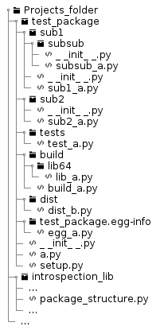

# DE003 Design of automatic detection of the dependencies

## Introduction

The **setuptools** system provides a number of automatic discovery features, e.g. concerning the automatic detection of the sub-packages, but not for the auto-generation of the dependencies and restrictions. Of cause, there are ready solutions, e.g. [importlab](https://github.com/google/importlab), but they have own limitations. In general, it is possible to generate specific format configuration files based only on the static analysis of the source code and file system with the accepable data completeness - only minor manual adjustments will be required afterwards. With the most part of the 'boiler-plate' coding tasks being automated the amount of configuration work as well as probability of the errors is significantly reduced.

This document discussed the major design decisions / patterns used in the implementation of the static code analysis based dependencies and package structure detection in the module *package_structure*.

## Main design decisions

* The analysis is applied to a single folder at a time, but recursively including all its sub-folders
* The analyzed folder must be a proper Python package (as in *import*, not *distribution*); it can be a sub-package of another package, but not a loose collection of Python source files (as scripts, etc.) - this limitation is because of the *relative imports* processing requirement
* The folder being a Python *import package* can also include sub-folders, which are not sub-packages (e.g. collection of tests or specific task scripts), but automatically included into the *distribution package* to be created, unless explicitely instructed otherwise
* Only the Python source files to be included into *distribution package* are considered in the analysis
* The anlysis is designed to be completely static, based on the analysis of the file structure and source code, whereas neither the modules in the analyzed package nor any dependencies should be imported in the process in order to avoid possible side effects
* Only the *import statements* as `import something` and `from somewhere import something` are taken into considiration, the *dynamic* import using functional calls, as of Python Standard Library *importlib.import_module*(), are ignored
* In the case of the dotted import names, as `import os.path` only the 'top level' part of the name is considered; the following up parts may be real sub-modules / sub-packages of the 'top level' object, or may be other modules / packages imported into the namespace of the 'top level' object - in the both cases it is responsibility of the authors / maintainers of that 'top level' object to care about the proper distribution
* Only the 'top level' dependencies directly mentioned in the modules found whithin the package are considered; the code to be distributed is already expected to be tested and proven working, thus no need for the circular dependencies, dependencies propagation and conflict analysis is required - the 3rd party libraries used are supposed to be properly packaged and distributed via a package management system (e.g. *pip*), which, usually, takes care of the 'dependencies hell'
* The 'top level' dependencies found to belong to the Python Standard Library are not included into the generated dependencies configuration
* The version restrictions on the Python interpreter and dependencies are inferred from the environment used during the analysis; they may be manually corrected (extended, removed) manually before the packaging process

## Basics of the Python import mechanism

There are two versions of the import statement:

```python
import something
```

and

```python
from something import something_else
```

The first variant imports an entire (sub-) package or module and makes its content visible / accessible to the module as a nested namespace, which elements / components become accessible using dot notation. It is not possible to import a specific function or class using this variant.

Note that *something* may be a 'top level' module (as in `import os`) or a 'top level' package (as in `import collections`), in which case its elements must be addressed within the module by prepending the respective module / package name in the dot notation, e.g. `os.walk()` or `collections.abc`, etc. It also may be a sub-module / sub-package, in which case the import name should also use the dot notation, as in `import collections.abc`; and the entire import name must be used as the prefix for addressing the components in the code, e.g. `collections.abc.Sequence`. However, in order to avoid long names, the imported (sub-) module / (sub-) package may be aliased as

```python
import collections.abc as c_acb
```

in which case the component's names must be prefixed by that alias, as in `c_abc.Sequence`.

**NB**: this type of aliasing is not the same as

```python
import collections.abc
c_acb = collections.abc
```

since in the later case both `c_abc` and `collections.abc` can be used as the prefix (both names exits simultaneously), whereas in the former case - only `c_abc` name exists.

**Warning**: the first part of the dotted name of a (sub-) package / module MUST be a real base name of a module or package in any of the folders listed in the Python system variable *sys.path*, otherwise the import is not possible, and **ImportError** is raised. However, this rule is not applicable for the following up parts. Usually, the dotted names give an impression of the nested *package -> sub-package -> module*, etc. structure, but it is not always true. For instance, in the Python Standard Library: *os* is, in fact, a module, not a package, but it imports and aliases other modules, thus *os.path* is just an alias for another module (on POSIX systems - *posixpath*); whereas *collections* is a package, and it has *abc* module within, although that module simply imports everything from the 'top level' *_collections_abc* module, thus, effectively, *collections.abc* and *_collections_abc* refer to the same set of objects (the second one is considered to be 'private' implementation, and not intended to be imported directly). In short, without sofisticated analysis, it is not possible to say if any part of a dotted name in the import statement is a real module / package or not, except for the first one.

Finally, the first variant of the import statement allows multiple imports, e.g.

```python
import os, collections.abc as c_abc, sys
```

which is completely equivalent to

```python
import os
import collections.abc as c_abc
import sys
```

The second import variant is designed for importing only part (one or several components) from the namespace of an module / package directly into the namespace of another module. The *something* part of the statement foloows the same rules as above - it may refer only to a namespace ((sub-) module / (sub-) package). The *something_else* part is, usually, a variable, a function or a class, however, a sub-module or sub-package is allowed as well. The important thing is that this *something_else* name becomes visible directly in the namespace of the module. Consider the following equivalent examples (as long as it concerns *join*() function) for illustration:

```python
import os
print(os.path.join('a','b'))
...
import os.path
print(os.path.join('a','b'))
...
from os import path
print(path.join('a','b'))
...
from os.path import join
print(join('a','b'))
```

The imported name (*something_else* part) may also be aliased in order to avoid names conflict or reduce the amount of typing, and multiple imports are allowed:

```python
from os.path import join as m_join, isfile
print(isfile(m_join('a','b')))
```

or

```python
from os.path import join as m_join
from os.path import isfile
print(isfile(m_join('a','b')))
```

are equivalent.

The second import statement variant also support relative import notation. Suppose, in the package *some_package* there are two sub-packages: *sub1* and *sub2*, and the module *a* in *sub1* wants to import some function *get_it*() from the module *b* in *sub2*, in which case the following statement can be used:

```python
from ..sub2.b import get_it
```

Each consecutive leading dot in the name means jumping one level up in the package hierarchical structure tree starting from the position of the module, where the import is made.

There is also functional call interface for the imports provided by the Standard Library - *importlib*, however it is considered to be a bad programming practise to use it instead of the import statements outside the situations requiring *dynamic* import. With the *dynamic* import one or another module is imported on demand, depending on the user actions or data input. Such functional call imports are not taken into account in the static code analysis.

## Folders and files filtering rules

The filtering is based on the Unix shell-style wildcards (see [Python fnmatch](https://docs.python.org/3/library/fnmatch.html)), i.e.

* \* - matches everything, any number of any characters, including an empty sub-string
* ? - matches any single character
* \[seq\] - matches any character in *seq*
* \[!seq\] - matches any character not in *seq*

The path to the folder being analyzed is used as a common prefix for the paths to all its included sub-folders and files, which is removed from those paths during the analysis. Basically, the paths *relative* to that 'parent' folder are used, but without the leading './' ('.\\' on Windows) modifier.

The folders matching patterns are applied to those relative paths, but only if the corresponding path refers to a sub-folder. The files matching patterns are applied to the base filenames part of the paths referring to the Python modules.

The folders matching patterns may contain the path separators using either POSIX or Windows convention, which will be automatically adjusted to the convention of the OS, under which the code is executed.

The patterns to be included by default are:

* Files:
  * `setup.py`
* Folders:
  * `build`
  * `build/*`
  * `*/build`
  * `*/build/*`
  * `dist`
  * `dist/*`
  * `*/dist`
  * `*/dist/*`
  * `*egg-info*`
  * `*dist-info*`

These defaults should prevent inclusion of the **setuptools** packaging process related files and folders.

## Detection of the dependencies origin and location

The location of a 'top level' package or module can be obtained using Standard Library function *importlib.util.find_spec*(). If such module or package cannot be found in any of the folders registered in the Python system variable *sys.path* this function returns **None** value. If such module / package is located, the returned value is an instance of the class **importlib.machinery.ModuleSpec**, which will have *origin* attribute storing the path to the module or the `__init__.py` of the package. Furthermore, in the case of a package another attribute *submodule_search_locations* will hold a list of strings - paths to the folders, where the sub-packages and sub-modules are located; whereas in the case of the module found at the top level this attribute holds **None** value.

Normally, the 3rd party packages / modules installed via the *pip* package manager should be placed into a folder with the following path `{prefix}/lib/python{X}.{Y}/site-packages`, where `{prefix}` is either the standard sytem- or user-installation search prefix (see *sys.base_prefix* system variable), or the virtual environment path prefix (see *sys.prefix* system variable). If a virtual enviroment is not initialized, both *sys.base_prefix* and *sys.prefix* hold the same value. `{X}` is the Python 'major' version number, and `{Y}` - minor version number (e.g. 3.6 or 3.9, etc.). However, in some cases, e.g. Debian derivative Linux distributions - the *pip* package manager is usually installed from *apt* repository, as well as a number of other Python packages. For such packages the path should include 'dist-packages' part instead of 'site-packages'.

The Standard Library packages / modules can be distinguished by the combination of two properties of their path: a) it starts with the common Python prefix (*sys.prefix* or *sys.base_prefix*), and b) it does not contain sub-strings 'site-packages' or 'dist-packages'.

The modules / packages paths containing 'site-packages' are, most probably, installed via the *pip* manager, whereas paths containing 'dist-packages' sub-string may be installed via *pip*. The corresponding 'parent' folders should be analyzed further; for every *pip* installed package / module there should be an 'egg-info' or 'dist-info' subfolder. The exact name of the corresponding distribution info folder is not known *a priory*, but it may be found using static analysis of the content of the 'parent' folder.

Packages / modules with the paths not containing 'site-packages' or 'dist-packages' sub-string, nor starting with the common Python prefix (*sys.prefix* or *sys.base_prefix*) are, most probably, 3rd party packages not installed properly, but manually added to the *sys.path*.

## Metadata

This section describes the metadata extraction rules, which are applicable for the simplest case - direct, static definition using one-line statements. More complex cases, e.g. multi-line spanning definitions, etc. may require more efforts, e.g. *tokenize* module functionality (Standard Library) or even lexical / syntax analysis.

* The package's metadata is defined in the *\_\_init\_\_.py* module in the 'root' folder of the package
* The metadata is defined via a set of assignments in the form `name = value`, where:
  * `name` is a dundler, i.e. it starts and ends with double underscore ('\_\_')
  * the `name` must be one of the currently recognized values (the list may be extended later):
    * \_\_version\_\_
    * \_\_version\_info\_\_
    * \_\_version_suffix\_\_
    * \_\_project\_\_
    * \_\_date\_\_
    * \_\_status\_\_
    * \_\_author\_\_
    * \_\_maintainer\_\_
    * \_\_copyright\_\_
    * \_\_license\_\_
  * `value` is a valid Python expression, e.g. a literal: string, integer, floating point or boolean - or an expression, which is evaluated to a literal
  * the value of the `value` is read-out from the source file without data conversion and evaluation of the expressions
* The read-out metadata is neither modified nor analyzed, it is just stored - further processing of the data is out of the scope of this module; and this task is to be delegated to the clients of this module, when required.

The extracted metadata is to be stored as a dictionary, consisting of the following entries:

```python
name : {'line' : lineno, 'value' : value}
```

where `lineno` is the source code file line number (indexing from zero), in which the corresponding `name = value` definition is found.

## Example

Consider the following example (can be used for testing). There is a folder *Project_folder*, which is not a Python package itself, but it contains several Python packages, with *test_package* amongst them.



Considering the file structure of the folder *test_package* the tables below list relative paths to all Python files (ignoring the default filtering settings) and the fully qualified package names for all sub-folders, when applicable.

| (Sub-) folder relative path | Package name             |
| --------------------------- | ------------------------ |
| ./                          | test_package             |
| ./sub1                      | test_package.sub1        |
| ./sub1/subsub               | test_package.sub1.subsub |
| ./sub2                      | test_package.sub2        |
| ./tests                     | **Not a package**        |
| ./build                     | **Not a package**        |
| ./build/lib64               | **Not a package**        |
| ./dist                      | **Not a package**        |
| ./test_package.egg-info     | **Not a package**        |

| List of reduced paths to the Python modules |
| ------------------------------------------- |
| \_\_init.py\_\_                             |
| `a.py`                                      |
| `setup.py`                                  |
| sub1/\_\_init.py\_\_                        |
| sub1/sub1_a.py                              |
| sub1/subsub/\_\_init.py\_\_                 |
| sub1/subsub/subsub_a.py                     |
| sub2/\_\_init.py\_\_                        |
| sub2/sub2_a.py                              |
| tests/test_a.py                             |
| build/build_a.py                            |
| build/lib64/lib_a.py                        |
| dist/dist_b.py                              |
| test_package.egg-info/egg_a.py              |

However, with the default filtering applied this list is reduced to

| List of reduced paths to the Python modules |
| ------------------------------------------- |
| \_\_init.py\_\_                             |
| `a.py`                                      |
| sub1/\_\_init.py\_\_                        |
| sub1/sub1_a.py                              |
| sub1/subsub/\_\_init.py\_\_                 |
| sub1/subsub/subsub_a.py                     |
| sub2/\_\_init.py\_\_                        |
| sub2/sub2_a.py                              |
| tests/test_a.py                             |

This example is only for illustration of the dependencies and import names resolution, thus the code sniplets below are not intended to be executed or imported.

`__init__.py`

```python
__project__ = 'test'
__version_info__ = (0.1.2)
__version_suffix__ = '-dev1'
__version__ = '.'.join(map(str, __version_info__))
__author__ = 'anton'
_author__ = 'john'
__date__ = 'jan 01'
__status__ = 'whatever'
__maintainer__ = 'whoever'
__license__ = 'LSD'
__copyright__ = 'what?'


import os, sys as my_sys

raise ImportError

def a():
    __author__ = 'john'
```

Hence, the metadata to be propertly extracted is:

```python
{
  '__project__' : {
    'line' : 0,
    'value' : "'test'"
  },
  '__version_info__' : {
    'line' : 1,
    'value' : '(0.1.2)'
  },
  '__version_suffix__' : {
    'line' : 2,
    'value' : "'-dev1'"
  },
  '__version__' : {
    'line' : 3,
    'value' : "'.'.join(map(str, __version_info__))"
  },
  '__author__' : {
    'line' : 4,
    'value' : "'anton'"
  },
  '__date__' : {
    'line' : 6,
    'value' : "'jan 01'"
  },
  '__status__' : {
    'line' : 7,
    'value' : "'whatever'"
  },
  '__maintainer__' : {
    'line' : 8,
    'value' : "'whoever'"
  },
  '__license__' : {
    'line' : 9,
    'value' : "'LSD'"
  },
  '__copyright__' : {
    'line' : 10,
    'value' : "'what?'"
  }
}
```

`a.py`

```python
import os.path as os_path
import some_package

from sys import path

raise ImportError
```

`setup.py`

```python
import setuptools

raise ImportError
```

`sub1/__init__.py`

```python
__version__ = '0.1.1'

import os.path

raise ImportError
```

Hence, the metadata to be propertly extracted is:

```python
{
  '__version__' : {
    'line' : 0,
    'value' : "'0.1.1'"
  }
}
```

`sub1/sub1_a.py`

```python
import some_package.sub

from os.path import join as my_join, isdir

from ..a import something # -> test_package.a.something

from ...introspection_lib.package_structure import something_else
# error, should be ignored

raise ImportError
```

`sub1/subsub/__init__.py`

```python
__whatever__ = ''

import pip

raise ImportError
```

Hence, the metadata to be propertly extracted is an empty dictionary.

`sub1/subsub/subsub_a.py`

```python
from ...sub2 import sub2_a #-> test_package.sub2.sub2_a

raise ImportError
```

`sub2/__init__.py`

```python
raise ImportError
```

`sub2/sub2_a.py`

```python
from ..sub1.sub1_a import something # -> test_package.sub1.sub1_a.something
```

Hence, the metadata to be propertly extracted is an empty dictionary.

`tests/test_a.py`

```python
import unittest

raise ImportError
```

`build/build_a.py`

```python
import package1

raise ImportError
```

`build/lib64/lib_a.py`

```python
import package2

raise ImportError
```

`dist/dist_b.py`

```python
import package3

raise ImportError
```

`test_package.egg_info/egg_a.py`

```python
raise ImportError
```

Thus, ignoring the filtering, the import names look-up table is:

```python
{
  '__init__.py' : {
    'os' : 'os',
    'my_sys' : 'sys'
  },
  'a.py' : {
    'os_path' : 'os.path',
    'some_package' : 'some_package'
  },
  'setup.py' : {
    'setuptools' : 'setuptools'
  },
  'sub1/__init__.py' : {
    'os.path' : 'os.path'
  },
  'sub1/sub1_a.py' : {
    'some_package.sub' : 'some_package.sub',
    'my_join' : 'os.path.join',
    'isdir' : 'os.path.isdir',
    'something' : 'test_package.a.something'
  },
  'sub1/subsub/__init__.py' : {
    'pip' : 'pip'
  },
  'sub1/subsub/subsub_a.py' : {
    'sub2_a' : 'test_package.sub2.sub2_a' 
  },
  'sub2/sub2_a.py' : {
    'something' : 'test_package.sub1.sub1_a.something'
  },
  'tests/test_a.py' : {
    'unittest' : 'unittest'
  },
  'build/build_a.py' : {
    'package1' : 'package1'
  },
  'build/lib64/lib_a.py' : {
    'package2' : 'package2'
  },
  'dist/dist_b.py' : {
    'package3' : 'package3'
  }
}
```

And the list of dependencies (not in order) is:

```python
['some_package', 'setuptools', 'pip', 'package1', 'package2', 'package3']
```

because, *os*, *sys* and *unittest* are parts of the Standard Library, *test_package* is the folder being analysed (thus ignored), and the relative import path pointing to the *introspection_lib* is improper in the context of the example files structure.

With the default filtering the list of the dependencies is reduced to:

```python
['some_package', 'pip']
```

And the import names look-up table is:

```python
{
  '__init__.py' : {
    'os' : 'os',
    'my_sys' : 'sys'
  },
  'a.py' : {
    'os_path' : 'os.path',
    'some_package' : 'some_package'
  },
  'sub1/__init__.py' : {
    'os.path' : 'os.path'
  },
  'sub1/sub1_a.py' : {
    'some_package.sub' : 'some_package.sub',
    'my_join' : 'os.path.join',
    'isdir' : 'os.path.isdir',
    'something' : 'test_package.a.something'
  },
  'sub1/subsub/__init__.py' : {
    'pip' : 'pip'
  },
  'sub1/subsub/subsub_a.py' : {
    'sub2_a' : 'test_package.sub2.sub2_a' 
  },
  'sub2/sub2_a.py' : {
    'something' : 'test_package.sub1.sub1_a.something'
  },
  'tests/test_a.py' : {
    'unittest' : 'unittest'
  }
}
```
