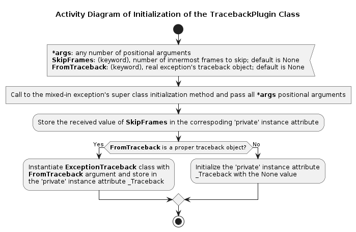
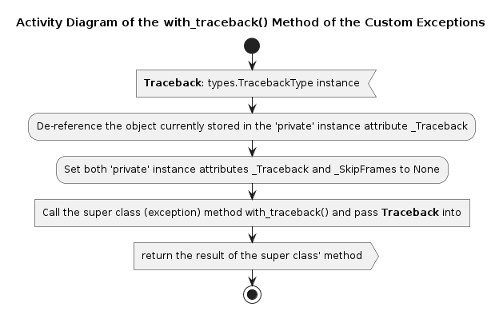
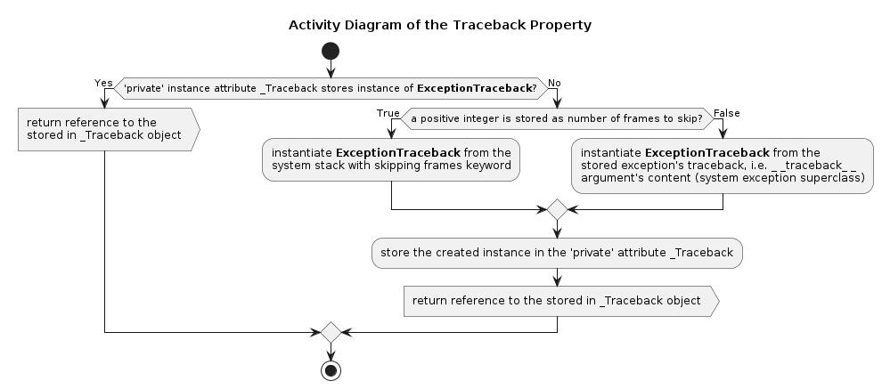
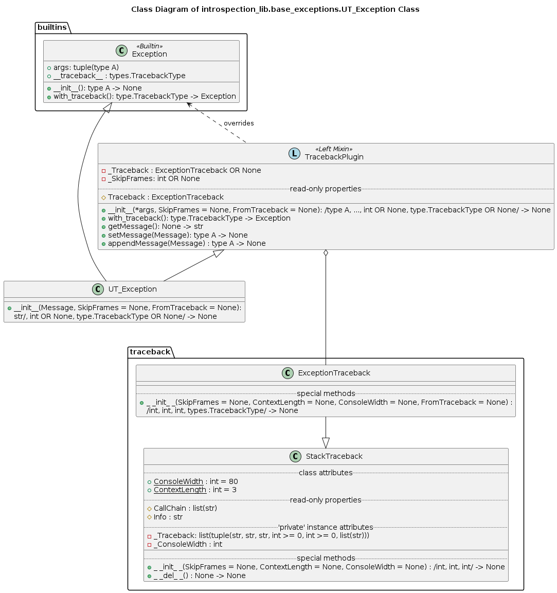

# Module introspection_lib.base_exceptions Reference

## Scope

This document describes the intended usage, design and implementation of the functionality implemented in the module **base_exceptions** of the library **introspection_lib**. The API reference is also provided.

The functional objects covered in this document are:

* (helper) function **GetObjectClass**()
* class **UT_Exception**
* class **UT_TypeError**
* class **UT_ValueError**
* class **UT_AttributeError**
* class **UT_IndexError**
* class **UT_KeyError**
* tuple **UT_Exception_Check** listing all 6 defined exceptions

## Intended Use and Functionality

In Python 3 programming language the standard exception class' intance has a 'special' attribute *\_\_traceback\_\_* storing an instance of **types.TracebackType**, which refers to this exception traceback. Basically, the intercepted (caught) exception can be analyzed as follows:

```python
try:
    #do some stuff, which may lead to a TypeError exception
    ...
except TypeError as err:
    Traceback = err.__traceback__
    #analyze the traceback
    ...
```

For instance, the module **introspection_lib.traceback** provides class **ExceptionTraceback**, which can be instantiated from such a traceback object, and will generate the machine- and human-readable call chain as well as the extended human-readable traceback per-frame dump.

The purpose of this module is to provide a framework of the custom exceptions, which extend the standard classes **Exception**, **TypeError**, **ValueError**, **AttributeError**, **IndexError** and **KeyError** by adding the functionality provided by the **introspection_lib.traceback.ExceptionTraceback** class.

The custom versions of the standard exceptions are their actual sub-classes (see diagram below), so the clause `except TypeError` will intercept both the **TypeError** and **UT_TypeError**, whereas the clause `except UT_TypeError` will intercept only **UT_TypeError**, but not any other exeption in the diagram below.


In addition, all defined custom exceptions are registered as *virtual* sub-classes of **UT_Exception**.


The design is to enable use of **UT_Exception** in the *try...except* clause to catch any of the defined custom exceptions. This approach works fine with Python 2.7, where the check in the *except* clause relies upon *isinstance*() function. In Python 3 (up to v3.8), however, the *except* clause check does not use *isinstance*() check, but checks the MRO directly at low level (C-implementation). Instead of meddling with metaclasses a simple solution is added - a tuple **UT_Exception_Check**, which lists all custom exceptions defined in this module. Use this 'umbrella' to catch any custom exception.

The added functionality of the custom exceptions is implemented as a read-only property *Traceback*, which returns an instance of **introspection_lib.traceback.ExceptionTraceback** class. Thus, the traceback analysis of any of the custom exception can be performed as in the example below:

```python
try:
    #do some stuff, which may lead to an exception (use custom ones!)
    ...
except UT_Exception_Check as err:
    print(err.Traceback.Info) #complete traceback per-frame dump
    print(err.Traceback.CallChain) #list of the qualified names of the callers
    ...
```

Normally, the respective traceback analysis object is created 'on-the-fly' upon the first access of the property *Traceback* after the interception of the exception. The only deviation from this rule is when another traceback is passed into the initialization method of a custom exception (discussed below), in which case the traceback already exists, thus the analysis object can be created as well. Based on this schema, the custom exception provide 4 modes of the traceback analysis usage / modification.

*Normal mode*:

```python
def Inner():
    raise UT_Exception('Test')

def Middle():
    return Inner()

def Outer():
    return Middle()

try:
    Outer()
except UT_Exception as err:
    print(err.Traceback.CallChain)
```

In this case the *Traceback* refers to the un-modified traceback, i.e. the call chain is \<'module'\> -> Outer() -> Middle() -> Inner().

*Truncating mode*:

```python
def Inner():
    raise UT_Exception('Test', SkipFrames = 2)

def Middle():
    return Inner()

def Outer():
    return Middle()

try:
    Outer()
except UT_Exception as err:
    print(err.Traceback.CallChain)
```

In this case the *Traceback* refers to the modified traceback with the 2 innermost frames being hidden, i.e. the reported call chain is \<'module'\> -> Outer(). This is convenient when you want to hide some implementation details, for example, your function or method uses some type-checking helper function method, and this detailed information will only complicate the debugging process.

**Note** that the *\_\_traceback\_\_* argument will still hold the actual exception traceback (full 4 elements call chain).

*Replacement mode*:

```python
def Inner(Value):
    if not isinstance(Value, int):
        raise UT_TypeError(Value, int)
    elif Value <= 0:
        raise UT_ValueError(Value, '> 0')

def Middle(Value):
    return Inner(Value)

def Outer(Value):
    return Middle(Value)

try:
    #do some stuff
    try:
        Outer(2.3)
    except (UT_TypeError, UT_ValueError) as err:
        Message = '{} - required a positive integer'.format(err.args[0])
        raise UT_Exception(Message, FromTraceback = err.__traceback__)
    #do some stuff
except UT_Exception_Check as err:
    print(err.Traceback.CallChain)
```

In this case the *Traceback* refers to the substituted traceback with the call chain being \<'module'\> -> Outer() -> Middle() -> Inner(), although it has been raised directly in the module's top frame. This is convenient when you want to hide some implementation details, or, as in this example, for coercing of the exceptions. In this example, not integer input value results in sub-class of TypeError, whereas integer but not positive - ValueError. Both situations are caught and converted into a single (combined) error with extended explanation (error message) and preserved exception traceback.

**Note** that the *\_\_traceback\_\_* argument will still hold the actual exception traceback (only the module's frame). The keyword argument *FromTraceback* (substitution) takes precedent on the *SkipFrames* (truncation).

*Chaining mode*:

```python
def Inner(Value):
    if not isinstance(Value, int):
        raise UT_TypeError(Value, int)

def Middle(Value):
    return Inner(Value)

def Outer(Value):
    return Middle(Value)

try:
    #do something
    try:
        Outer(2.3)
    except UT_TypeError as err:
        #do something
        if something != something_else:
            raise UT_Exception('Oops! Something is wrong').with_traceback(err.__traceback__)
except UT_Exception_Check as err:
    print(err.Traceback.CallChain)
```

In this case the actual traceback of the latest exception (only the module's frame) is extended by the traceback of the original exception (module's frame, Outer(), Middle() and Inner() frames). This traceback is refered by the *\_\_traceback\_\_* attribute, which is used for the creation of the traceback analysis objecyt returned by the *Traceback* property.

**Note** call of the method *with_traceback*() overrides the effects of the truncation and substitution of the traceback, regardless if they were applied to the original or secondary exceptions.

*Additional notes on chaining*:

Apart from the explicit chaining using *with_traceback*() method there is also *implicit* chaining, which happends under the following conditions:

* (re-) raise of an exception inside `except` or `finally` clause during handling of an exception
* an exception being raised from another as `raise SomeException(...) from AnotherException`

In the both cases the exception's traceback (as *\_\_traceback\_\_* or *Traceback* attribute's content) is not affected, unless the method *with_traceback*() is called. However, the content of the 'special' attributes *\_\_cause\_\_* and / or *\_\_context\_\_* inherited from the standard exception classes are modified, and can be analyzed. If the exception is not caught (propagated to the top level of the interactive interpreter loop), the corresponding information is displayed in the dump.

This standard behaviour is inherited without modification, including the ability to suppress the implicit chaining during (re-) raise as `raise SomeException(...) from None'.

## Design and Implementation

The design of the classes and implementation of the added functionality is based on the use of a *left mixin* class **TracebackPlugin**: a custom exception sub-classes this mixin **TracebackPlugin** first (as the first, left parent) and then - the respective standard exception class, e.g. `class UT_TypeError(TracebackPlugin, TypeError): ...`.

This mixin class has both methods: *\_\_init\_\_*() and *with_traceback*() - also present in any standard exception class; and due to the order of inheritance, they are called if the mixed in class (custom exception) does not have own version or reverts to the *super*() call. In fact, these two method of the mixin class, in turn, revert to the *super*() call and perform some modifications of the class' state (data attributes); and due to the manner of the method resolution (MRO model) the respective methods of the parent standard exception class are called.

The custom exception classes also have their own versions of the *\_\_init\_\_*() methods in order to construct a single string error message from a variable number of the arguments of the variable types (different signatures for the different custom exceptions). Therefore, the instantiation of a custom exception happens as the following call chain CustomException.\_\_init\_\_(...) -> TracebackPluging.\_\_init\_\_() -> StandardException.\_\_init\_\_(), see diagrams below.




The method *with_traceback*() of a custom exception is inherited from the mixin, not from the actual exception parent, i.e. the call chain is CustomException.with_traceback(...) = TracebackPluging.with_traceback_() -> StandardException.with_traceback(), see diagrams below.



The property *Traceback* of the custom exceptions is also inherited from the mixin class, and it works as follows:



The described functionality is achieved via the multiple inheritance as shown below for the **UT_Exception** and **UT_TypeError** classes.




The class **UT_Exception** is not an actual super class for any of the other custom exceptions (neither it is a sub-class of any of them). However, it is made a *virtual* super class for them by hooking the 'is a' MRO method ('special' class method *\_\_subclasshook\_\_*()). In addition to the standard 'is a' check on direct descendancy, the 'has a' check is added - any class having *Traceback* attribute is considered to be (virtual) sub-class of the **UT_Exception**. in addition, it is ensured that such 'has a' check is not applied in the case of the real sub-classes of **UT_Exception**, which should revert to the standard 'is a' check (see diagram below).


Finally, the custom exceptions **TypeError**, **ValueError** and **AtrubuteError** resolve the class / type name of the passed argument with help of the function **GetObjectClass**() implemented in this module, which activity diagram is given below.


## API Reference

### Global Variables

* *UT_Exception_Check* - a tuple listing all module defined custom exceptions, to be used as an 'umbrella' in the *except* clause to catch any of these exceptions.

### Functions

**GetObjectClass**(gObject: Any)

*Signature*:

type A -> str

*Args*:

* *gObject*: type A; the object to be analyzed

*Returns*:

**str**: the determined class or type name

*Description*:

Helper function. Attempts to extract the class's name of the passed class or instance of a class. The fallback option is *str(type(Value))* when the class's name cannot be extracted.

### Class TracebackPlugin

Left plugin class implementing the built-in traceback aalysis functionality. Cannot be instantiated by itself, since **TypeError** will be raised. Must be used only as left plugin for sub-classing exceptions.

__*Class and Instance Data Attributes*__:

* **Traceback**: (read-only property) instance of **introspection_lib.traceback.ExceptinTraceback** class to provide the machine- and human-readable exception traceback analysis

__*Initialization*__:

**\_\_init\_\_**(*args, SkipFrames = None, FromTraceback = None)

*Signature*:

/type A, int > 0 OR None, types.TracebackType OR None/ -> None

*Args*:

* _*args_: type A; any number of arguments of the exception
* *SkipFrames*: (keyword) int > 0 OR None; number of the innermost frames to remove from the actual traceback, ignored if the keyword argument *FromTraceback* holds a proper traceback object
* *FromTraceback*: (keyword) types.TracebackType OR None; substitute traceback (from another exception) to use; if it is provided and holds a proper traceback object the *SkipFrames* argument is ignored

*Description*:

Hooks into instantiation of a custom exception. Passes the provided positional arguments into the standard parent exception initializer. Then if a substitution traceback is passed (*FromTraceback* keyword) the analysis object is created from it and stored (see *Traceback* property); otherwise - it will be created from the actual traceback upon accessing *Traceback* property. In the second case if the *SkipFrames* was passed as a positive integer, the respective number of the innermost frames will be skipped. Note, that call of the method *with_traceback*() overrides both the truncation and substitution of the traceback - the actual one will be used, including the extension frames.

**Note**: this left mixin class is not supposed to be instantiated on itself. If, at least, one positional argument is provided such an attempt will result in **TypeError**. This is, actually, a hooking into the instantiation of the mixed-in exception class.

__*Instance methods*__:

**with_traceback**(Traceback)

*Signature*:

types.TracebackType -> Exception

*Args*:

* *Traceback*: types.TracebackType; a traceback object of an exception, i.e. the value stored in the exception's attribute *\_\_traceback\_\_*

*Returns*:

**Exception**: instance of any sub-class of the standard exception, in fact, the reference to the instance of the same custom exception class, into which this plugin is added (mixed-in)

*Description*:

Overrides the standard exceptions' method; ensures the de-referencig of the stored exception traceback instance and sets the corresponding 'private' attributes to None, thus when requested the traceback analysis object will be created from the actual traceback of the exception. Then it reverts to the original version of the same method.

### Class UT_Exception

Base custom exception, which is considered to be a base class (real or virtual) to all custom exceptions. Should be instantiated as:

* UT_Exception('Message')
* UT_Exception('Message', SkipFrames = N)
* UT_Exception('Message', FromTraceback = Some_Traceback)

Sub-classes the standard **Exception** and the left plugin **TracebackPlugin**.

__*Class and Instance Data Attributes*__:

* *args*: tuple(str x1); one string element tuple storing the passed message. Inherited from the standard exceptions.
* *\_\_traceback\_\_*: types.TracebackType; stores the actual traceback of the exception. Inherited from the standard exceptions.
* *Traceback*: (read-only property) instance of **introspection_lib.traceback.ExceptinTraceback** class to provide the machine- and human-readable exception traceback analysis. Inherited from **TracebackPlugin** mixin class.

__*Initialization*__:

**\_\_init\_\_**(Message, *, SkipFrames = None, FromTraceback = None)

*Signature*:

str/, int > 0 OR None, types.TracebackType OR None/ -> None

*Args*:

* *Message*: str; the error message
* *SkipFrames*: (keyword) int > 0 OR None; number of the innermost frames to remove from the actual traceback, ignored if the keyword argument *FromTraceback* holds a proper traceback object
* *FromTraceback*: (keyword) types.TracebackType OR None; substitute traceback (from another exception) to use; if it is provided and holds a proper traceback object the *SkipFrames* argument is ignored

*Description*:

The single mandatory argument (the error message) is stored as the only element of the args tuple attribute. If the *FromTraceback* keyword argument holds the proper value, the traceback analysis object is created immediately from the substituion object; otherwise its creation is delayed until the first access of the property *Traceback*, in wich case the actual traceback can be truncated is *SkipFrames* is provided as a positive integer. Note that if the method *with_traceback()* is called the truncated or substituted traceback is replaced by the actual one, including the chained frames.

__*Instance methods*__:

**with_traceback**(Traceback): types.TracebackType -> Exception

Inherited from **TracebackPlugin** mixin class.

### Class UT_TypeError

Custom version of **TypeError** with the added human-readable traceback analysis. Should be instantiated as:

* UT_TypeError(Value, type / class OR seq(type / class))
* UT_TypeError(Value, type / class OR seq(type / class), SkipFrames = N)
* UT_TypeError(Value, type / class OR seq(type / class), FromTraceback = Some_Traceback)

Sub-classes the standard **TypeError** and the left plugin **TracebackPlugin**, also is a virtual sub-class of **UT_Exception**.

Has the same API as **UT_Exception**, except for the instantiation.

__*Initialization*__:

**\_\_init\_\_**(gObject, seqTypes, *, SkipFrames = None, FromTraceback = None): type A, type B/, int > 0 OR None, types.TracebackType OR None/ -> None

Converts the two passed mandatory (positional) arguments into a single string error message, which is stored as the only element of the args tuple attribute.

*Args*:

* *gObject*: type A; the object involved
* *seqTypes*: type B; any single type / class or a sequence of types or classes, which the object was expected to be
* *SkipFrames*: (keyword) int > 0 OR None; number of the innermost frames to remove from the actual traceback, ignored if the keyword argument *FromTraceback* holds a proper traceback object
* *FromTraceback*: (keyword) types.TracebackType OR None; substitute traceback (from another exception) to use; if it is provided and holds a proper traceback object the *SkipFrames* argument is ignored

### Class UT_ValueError

Custom version of **Valuerror** with the added human-readable traceback analysis. Should be instantiated as:

* UT_ValueError(Value, 'Ranges message')
* UT_ValueError(Value, 'Ranges message', SkipFrames = N)
* UT_ValueError(Value, 'Ranges message', FromTraceback = Some_Traceback)

Sub-classes the standard **ValueError** and the left plugin **TracebackPlugin**, also is a virtual sub-class of **UT_Exception**.

Has the same API as **UT_Exception**, except for the instantiation.

__*Initialization*__:

**\_\_init\_\_**(gObject, strRanges, *, SkipFrames = None, FromTraceback = None): type A, str/, int > 0 OR None, types.TracebackType OR None/ -> None

Converts the two passed mandatory (positional) arguments into a single string error message, which is stored as the only element of the args tuple attribute.

*Args*:

* *gObject*: type A; the object involved
* *strRanges*: str; explanation on the violated limitations / ranges
* *SkipFrames*: (keyword) int > 0 OR None; number of the innermost frames to remove from the actual traceback, ignored if the keyword argument *FromTraceback* holds a proper traceback object
* *FromTraceback*: (keyword) types.TracebackType OR None; substitute traceback (from another exception) to use; if it is provided and holds a proper traceback object the *SkipFrames* argument is ignored

### Class UT_AttributeError

Custom version of **AttributeError** with the added human-readable traceback analysis. Should be instantiated as:

* UT_AttributeError(Object, 'Attr Name')
* UT_AttributeError(Object, 'Attr Name', SkipFrames = N)
* UT_AttributeError(Object, 'Attr Name', FromTraceback = Some_Traceback)

Sub-classes the standard **AttributeError** and the left plugin **TracebackPlugin**, also is a virtual sub-class of **UT_Exception**.

Has the same API as **UT_Exception**, except for the instantiation.

__*Initialization*__:

**\_\_init\_\_**(gObject, strAttribute, *, SkipFrames = None, FromTraceback = None): type A, str/, int > 0 OR None, types.TracebackType OR None/ -> None

Converts the two passed mandatory (positional) arguments into a single string error message, which is stored as the only element of the args tuple attribute.

*Args*:

* *gObject*: type A; the object involved
* *strAttribute*: str; name of the involved attribute
* *SkipFrames*: (keyword) int > 0 OR None; number of the innermost frames to remove from the actual traceback, ignored if the keyword argument *FromTraceback* holds a proper traceback object
* *FromTraceback*: (keyword) types.TracebackType OR None; substitute traceback (from another exception) to use; if it is provided and holds a proper traceback object the *SkipFrames* argument is ignored

### Class UT_IndexError

Custom version of **IndexError** with the added human-readable traceback analysis. Should be instantiated as:

* UT_IndexError('Object name', Index)
* UT_IndexError('Object name', Index, SkipFrames = N)
* UT_IndexError('Object name', Index, FromTraceback = Some_Traceback)

Sub-classes the standard **IndexError** and the left plugin **TracebackPlugin**, also is a virtual sub-class of **UT_Exception**.

Has the same API as **UT_Exception**, except for the instantiation.

__*Initialization*__:

**\_\_init\_\_**(Name, Index, *, SkipFrames = None, FromTraceback = None): str, int/, int > 0 OR None, types.TracebackType OR None/ -> None

Converts the two passed mandatory (positional) arguments into a single string error message, which is stored as the only element of the args tuple attribute.

*Args*:

* *Name*: str; name of a sequence object involved
* *Index*: index; element's index, which is missing
* *SkipFrames*: (keyword) int > 0 OR None; number of the innermost frames to remove from the actual traceback, ignored if the keyword argument *FromTraceback* holds a proper traceback object
* *FromTraceback*: (keyword) types.TracebackType OR None; substitute traceback (from another exception) to use; if it is provided and holds a proper traceback object the *SkipFrames* argument is ignored

### Class UT_KeyError

Custom version of **KeyError** with the added human-readable traceback analysis. Should be instantiated as:

* UT_KeyError('Object name', 'Key Name')
* UT_KeyError('Object name', 'Key Name', SkipFrames = N)
* UT_KeyError('Object name', 'Key Name', FromTraceback = Some_Traceback)

Sub-classes the standard **KeyError** and the left plugin **TracebackPlugin**, also is a virtual sub-class of **UT_Exception**.

Has the same API as **UT_Exception**, except for the instantiation.

__*Initialization*__:

**\_\_init\_\_**(Name, Key, *, SkipFrames = None, FromTraceback = None): str, str/, int > 0 OR None, types.TracebackType OR None/ -> None

Converts the two passed mandatory (positional) arguments into a single string error message, which is stored as the only element of the args tuple attribute.

*Args*:

* *Name*: str; name of a sequence object involved
* *Key*: str; name of the key, which is missing
* *SkipFrames*: (keyword) int > 0 OR None; number of the innermost frames to remove from the actual traceback, ignored if the keyword argument *FromTraceback* holds a proper traceback object
* *FromTraceback*: (keyword) types.TracebackType OR None; substitute traceback (from another exception) to use; if it is provided and holds a proper traceback object the *SkipFrames* argument is ignored
