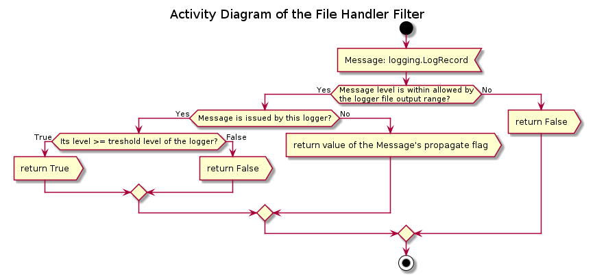

# Module introspection_lib.traceback Reference

## Scope

This document describes the intended usage, design and implementation of the functionality implemented in the module **logging** of the library **introspection_lib**. The API reference is also provided.

The functional objects covered in this document are:

* Class **DummyLogger**
* Class **DualLogger**

## Intended Use and Functionality

The Python Standard Library's module **logging** provides rich and powerful logging functionality, including multiple handlers per logger object, creation of loggers hierarchy tree and message propagation / delegation to parent, but it has a serious limitation - only the minimum threshold severity level of the event (message) can be set per logger or its attached handler. Therefore, it is not possible to separate and direct low level messages (e.g. DEBUG and INFO) into one stream, and the high severity level messages (e.g. ERROR and CRITICAL) into another stream, unless some clever, message level based filters are attached to the corresponding streams' handlers.

The situation becomes even more complicated if there is a requirement to aggregate the log messages from several (sub-) processes, for which the 'child' -> 'parent' message propagation model is designed, and print into the console only low level messages from some process, whereas only high level or all messages from other process.

This module addresses this issue by extending the functionality of the standard logger class under the following assumptions:

* There is a central, main process, which manages a number of sub-process, and it has no knowledge on their implementation, except that they accept a logger object passed as an argument
* Any such sub-process assumes that the passed logger object supports the standard API, namely the methods *setLevel*(), *debug*(), *info*(), *warning*(), *error*(), *critical*() and, possibly, *getChild*()
* Any such sub-process can use the passed logger directly, or create and use a 'child' logger, attached to the passed one
* Any such process doesn't care about the handlers attached to the passed logger or its 'parents', and it does not attach new handlers to any of the loggers, including a 'child' if such is created - at least, via *addHandler*()
* Any such sub-process can set the threshold level of the passed logger or its 'children' to any level any time using method *setLevel*()
* Any such sub-process can ask the passed logger or its 'children' to issue a message of any level
* The main process can define per logger object the minimum and maximum allowed levels range of the messages to be printed into the console, saved into the logger's own file and / or delegated to the logger's 'parent' file handler - with an own min-max range for each of the loggers and each of the output stream

A practical example:

* All ERROR and CRITICAL log messages generated within the main process as well as any of the managed sub-process should be saved into a file 'errors.log'
* All INFO and WARNING log messages generated within the main process as well as any of the managed sub-process should be saved into another file - 'process.log'
* All DEBUG messages generated within a specific sub-process should be saved into a different file, e.g. 'some_important_sub-process.log'
* Only INFO and WARNING messaged generated within a sub-process should be printed into the console
* Any message level >= INFO generated within the main process should be printed into the console

The functionality of the **DualLogger** class defined in this module can be use as in the listing below in order to implement such a process:

```python
from introspection_lib.logging import DualLogger

def sub_process(Logger):
    #do some processing
    Logger.debug('Some intemediate results or steps')
    #will not be printed, only logged into the sub-process' own log file
    if SomeErrorOccured:
        Logger.warning('Error occured, check the errors log file')
        #will be printed and logged into the main process's log file
        Logger.error('Actual error message')
        #will only be logged into the errors log file
        Result = False
    else:
        Logger.info('Success!')
        Result = True
    return Result

def main_process():
    RootLogger = DualLogger('some_process')
    #logger is named 'some_process'
    RootLogger.setLogFile('errors.log')
    RootLogger.setMinFileLevel('error')
    #responsible for console output and errors log file
    MainLogger = RootLogger.getChild('flow')
    #logger is named 'some_process.flow'
    MainLogger.setMinConsoleLevel('info')
    MainLogger.setLogFile('process.log')
    MainLogger.setMinFileLevel('info')
    MainLogger.setMaxFileLevel('warning')
    #responsible for the process main log file
    SubprocessLogger = MainLogger.getChild('sub_process')
    #logger is named 'some_process.flow.sub_process'
    SubprocessLogger.setLogFile('sub_process.log')
    SubprocessLogger.setMinConsoleLevel('info')
    SubprocessLogger.setMaxConsoleLevel('warning')
    SubprocessLogger.setMaxFileLevel('debug')
    #responsible for the sub-process's log file
    #
    #do some actual work
    MainLogger.info('Process started')
    #will be printed into the console and saved into the main process log file
    #
    #do some work
    MainLogger.debug('Some data and steps') #will be ignored!
    Result = sub_process(SubprocessLogger)
    if not Result: #error occured within the sub-process
        #do some checks
        if SomeCheckFailed:
            MainLogger.error('We are doomed!')
            #will be printed into the console and saved into the errors log file
        else:
            MainLogger.info('Recovered from an error')
            #will be printed into the console and saved into the main process
            #log file
    MainLogger.info('Process finished')
    #will be printed into the console and saved into the main process log file
```

In this example the output separation is implemented using the handlers' filtering only. In more complex situations, when the allowed ranges of the 'parent' and 'child' / 'children' loggers overlap, additional filtering can be applied as the minimum threshold level of the logger itself, or a range of message levels allowed to be propagated into the 'parent' file handlers. In short, the full filtering functionality is implemented in 4 groups of the instance methods:

* *setLevel*(Level) - the minimum message level threshold of the logger itself. The messages with lower level will not be issued at all by this logger regardless of the other filters settings. This value does not affect the handling of the messages received from the 'children' loggers, nor the propagation to this logger's 'parent'.
* *setMinConsoleLevel*(), *setMaxConsoleLevel*() - the minimum and maximum levels of the messages *generated by this logger*, which should be printed into the console. Does not affect the message propagation.
* *setMinFileLevel*(), *setMaxFileLevel*() - the minimum and maximum levels of the messages *generated by this logger* as well as *received from its 'children'*, which should be saved into the log file attached to this logger, if such file exists. Does not affect the message propagation.
* *setMinPropagateLevel*(), *setMaxPropagateLevel*() - the minimum and maximum levels of the messages *generated by this logger*, which should be allowed to be handled by the 'parents' of this logger. Basically, the messages with the level outside this range, should be ignored by the 'parent' file handlers, even if they are within the allowed range of the 'parent' file handlers. Does not affect the message propagation from the 'children', not the handling of the message by the own file handler, if such is attached to the current logger.

Any instance of the **DualLogger** class directly instantiated becomes effectively a 'root' of the hierarchy, with no connections between different roots. The 'children' loggers should be attached using the method *getChild*() to a 'root' logger, or any of its existing 'children'.

By default, none of the filters are applied: all minimum levels are set to below **logging.DEBUG** (including the logger's own threshold), and all maximum levels - to above **logging.CRITICAL**. Any instance of **DualLogger** can print into console as the defualt settings, where are no log files and respective handlers attached. The file logging must be initiated manually using method *setLogFile*(FileName = None), which operates under the following conventions:

* If the filename is not provided, a new log file is created in the current working directory with the base filename constructed from the date-time stamp (up to a second), name of the logger and '.log' extension
* If the filename is provided, it is treated as a path (absolute or relative to the current working directory) to a log file
  * If such file does not exist yet, it is created, and a new file handler is created, associated with this file and attached to the logger
  * If it exists, and is already in use by the current logger - nothing happends
  * If it exists, but not used by the current logger:
    * The currently used by the logger file is closed, lock released, and the current file handler is removed from the logger
    * The recuired file is opened in 'attach' mode, and the a file handler is created, associated with this file and attached to the logger
    * **Warning**: if this file is used by other objects, it may be locked, and an exception can be raised - depending on the OS.

The file logging by this logger instance can be disabled by calling the method *disableFileLogging*(), which closes the log file and removes the respective handler. It can be re-enabled later by calling the method *setLogFile*() with the same filename as before. Alternatively, the logging into file can be (temporary) disabled by setting the minimum level above **logging.CRITICAL**, e.g. `SomeLogger.setMinFileLevel('none')`, or maximum level below **logging.DEBUG**, e.g. `SomeLogger.setMaxFileLevel('all')`; the log file will not be closed, and the respective handler will not be removed.

Similarly, the console output can be disabled using min or max level filter's values: `SomeLogger.setMinConsoleLevel('none')` or `SomeLogger.setMaxConsoleLevel('all')`.

Finally, the second logger class **DummyLogger** is designed to dump all messages regardless of its threshold level and the level of the message. It is intended to be used as the default logger for the (sub-) processes. A function or method using this default logger can be implemented with an arbitrary detalisation level of the process logging, however, unless the user / client of this function / methods passes an different logger as an argument, neither console nor other stream output will be created. With this approach the implementation of a function / method should not care about the thresholds / filters levels, which can be defined by the client of this function / method as it is desired.

## Design and Implementation

The class diagram of the module is shown below.


Both the **DummyLogger** and the **DualLogger** follow the standard logging process flow, see diagram below.


The **DummyLogger** has no parent and does not propagate the messages. It also has no filters attached, and only one attached handler without any filters, which creates no output. Therefore, when asked to emit a log message it does absolutely nothing (if its level is set above the message's level) or dumps it into nothing (**NullHandler**).

Any 'root' **DualLogger** has a **StreamHandler** (*stderr*) attached, which is responsible for handling the messages genearated by this logger as well as received from any of its 'children'. The 'root' logger of this type has no parent and does not propagate the messages further. The 'children', however, have parents and propagate their messages up to the 'root' of the hierarchy, but do not have own **StreamHandler** handlers. Any of the loggers with the hierarchy can have a file handler attached.

The added functionality, i.e. min-max level filtering per output channel and per logger is implemented via filter objects attached to the loggers and to the handlers.

The logger's filter does not actually filter messages, it always returns **True**, but it adds two fields to the **logging.LogRecord** object representing the message in order to signal the handlers how to treat this message. Based on the message's level, the logger's own severity treshold level, the logger's console and propagation ranges it sets the values of two added fields to **True** or **False**. Note that the propagation flag affects only the output into the 'parents' handlers, not the actual propagation of the message.


The console handler filter simply returns the value of the message's console output flag. Thus, the logger issuing the message desides if it should be printed, and the console output handler of the 'root' logger rejects the messages marked with the **False** value of this flag, and prints out other messages.

The file output handler's filter rejects any message (generated by this logger or received from its 'children') if the message's level is outside the file output range defined by this logger. Otherwise it checks, which logger issued this message. If the message is issued by this logger, it is accepted if its level is above the logger's own threshold level, and it is rejected for the lower level. Otherwise the message is accepted or rejected based on the value of the propagation flag of the message.



This filters store a reference to a logger object, with which they are associated, and check the current values of the corresponding console output, file output and (file output) propagation ranges. Thus any logger can change these ranges at any time, and the changes will have effect. Note that the file logging range can be changes even if there is no attached log file at the moment.

The differentiation between the 'root' and 'child' instances of **DualLogger** occurs during the initialization of this class. If an instance of another logging class is passed into the initialization method, the created instance is set as a 'child' of the passed logger. The 'root' logger has no parent, does not propagate the messages, but has a console output handler attached. A 'child' logger always has a parent, propagates the messages, and is has no console handler attached. By default, all instances of the **DualLogger** class allow emission of any level of messages, printing out (into the console) and file output propagation of all emitted messages, as well as outputing into a file (if one is attached) of all emitted and received messages.


Any instance can attach or change the current log file using method *setLogFile*(). A path to an existing file can be passed, in which case the new entries will be appended to the file. A path to a non-existing file can be passed as well, in which case it will be created, provided that the path to its directory is valid. If filename / path is not passed as an argument, the log file is created in the current working directory with the automatically generated base filename, including the date-time stamp and logger's name.


If there is already a file handler, and it is associated with the same file, this method does nothing. If there is a file handler, and it is associated with a different file, the current file is flushed and closed, and the new log file is opened instead. This functionality is based upon the call of the method *disableFileLogging*(), which can be used also to disable the logging into the own file when required.


### Implementation Notes

Both classes **DummyLogger** and **DualLogger** sub-class the Standard Library's **logging.Logger** and have all fields and methods of a standard logger, see the Standard Library [logging module](https://docs.python.org/3/library/logging.html) documentation. However, naturally, the function *logging.getLogger*() cannot be used to create them, and some other limitations are applicable, as discussed below.

Concerning both classes: do not change the values of the fields *name*, *parent* and *propagate*, since it may break the functionality.

Concerning the class **DummyLogger**. Do not use method *getChild*(), keep on using the same instance for all (sub-) processes or create new instances if required, since the message propagation has no meaning for such a dummy / mock logger. In fact, the method of the super class is not redefined, therefore it will return not an instance of **DummyLogger**, but an instance of **logging.Logger**. Methods *setLevel*(), *isEnabledFor*() and *getEffectiveLevel*() are harmless but useless with a mock logger as well as the methods *addFilter*() and *removeFilter*(). Do not add new handlers, i.e. method *addHandler*(), since the logger will no longer be dummy, therefore the method *removeHandler*() should not be used either.

Concerning the class **DualLogger**. Instantiate this class to get a 'root' logger, you can create as many 'roots' as you like. Attach 'children' to any existing logger ('root' or not) using method *getChild*(); but remember that the new logger becomes a 'child' of the curren one, so you cannot add 'grand-child' even if a name with a dot inside is used. You can add and remove additional handlers, i.e. methods *addHandler*() and *removeHandler*() function as with a standard logger, e.g. for handling other streams, but consider using the appropriate filters (see API Reference), otherwise these new handlers will behave exactly as in the standard logging model. Finally, you can add or remove additional filters to the logger, see methods *addFilter*() and *removeFilter*().

The filters attached to a logger and its handlers store the reference to this logger via **weakref.proxy** object in order to facilitate the garbage collection concerning the circlar referencing.

The default formater applied to the both console and file handlers is stored in the class private attribute *_DefaultFormatter*, and the default format of the messages is `{asctime} {levelname}@{name} FROM {funcName} IN {filename} (LINE {lineno})\n{message}`, where the date-time format is `%Y-%m-%d %H:%M:%S`.

## API Reference

### Module Level Variables

Note that these varaibles are supposed to be constant! They can be used as the argument's values in the methods *setLevel*(), *setMinConsoleLevel*(), etc., as well as their string case-insensite aliases. E.g. `SomeLogger.setLevel(NONE)`, `SomeLogger.setLevel('NONE')`, `SomeLogger.setLevel('None')` and `SomeLogger.setLevel('none')` are equivalent, but `SomeLogger.setLevel(None)` is an error.

* ALL : int, allows everything to be logged, set to `logging.DEBUG - 1`
* DEBUG : int, alias for `logging.DEBUG`
* INFO : int, alias for `logging.INFO`
* WARNING : int, alias for `logging.WARNING`
* ERROR : int, alias for  `logging.ERROR`
* CRITICAL : int, alias for  `logging.CRITICAL`
* NONE : int, forbids anything to be logged, set to `logging.CRITICAL + 1`

### Class LoggerFilter

A simple data modifying filter intended to be used with a logger object, not with a handler. Adds two flag attributes to a record object - *IsToPrint* and *IsToPropagate* - to indicate if the message is intended to be handled by the console handler of this logger or its parent, and the file handler of its parent only respectively. The boolean value **True** is set if the issued message level is within the corresponding acceptance ranges defined by the logger, and **False** - otherwise. A reference to the concerned logger is to passed during instantiation of this class.

**Note** that it has a single method *filter*(), with a single argument - an instance of the **logging.LogRecord** class, i.e. a log message. This method only modifies the passed by reference object by adding to more attributes, but does not perform any checks, and it always returns **True**.

__*Instance Data Attributes*__:

* **parent**: proxy weak reference to an instance of the **DualLogger** class, to which this filter will be attached

__*Initialization*__:

**\_\_init\_\_**(Parent)

*Signature*:

DualLogger -> None

*Args*:

* *Parent*: DualLogger; reference to a logger instance

*Description*:

Stores the passed reference to a logger object in the instance attribite 'parent' as a proxy weak reference.

__*Instance methods*__:

**filter**(Record)

*Signature*:

logging.LogRecord -> bool

*Args*:

* *Record*: logging.Record; instance of, the log message to be processed

*Returns*:

**bool**: *True* if the filtering conditions are met (handle this message), *False* otherwise

*Description*:

This method should check if an issued log message is to be processed or not, and return the corresponding boolean value.

### Class ConsoleHandlerFilter

Filter for a console hanlder of a logger object. Allows only the messages, witch are marked to be intended for the console by a logger object, which issued that message - may be this logger or one of its children. The reference to the logger with the concerned handler attached must be passed to the instantiation method of this class. Sub-classes **LoggerFilter**.

**Note** that its single method *filter*() is re-defined: it does not modify the passed log message, but returns the value of the message's attribute *IsToPrint*.

### Class FileHandlerFilter

Filter for a file hanlder of a logger object. Allows only the messages with the level within the acceptance range of this handler (defined by the logger object) and either the message is issued by this logger or it is marked as to be propaged by a child logger issued this message. The reference to the logger with the concerned handler attached must be passed to the instantiation method of this class. Sub-classes **LoggerFilter**.

**Note** that its single method *filter*() is re-defined as follows:

* The passed log message object is not modified
* If the message's level less than the minimum or greater than the maximum level allowed for an attached file handler by the logger object - returns **False**
* If the message's level is within the min-max (inclusive) boundaries allowed for an attached file handler by the logger object, and the message was issued by this logger itself - returns **True**
* If the message's level is within the min-max (inclusive) boundaries allowed for an attached file handler by the logger object, and the message was issued by a 'child' of this logger - returns the value of the message's attribute *IsToPropagate*

### Class DummyLogger

Specialized sub-class of the **logging.Logger** class (Standard Python Library), which upon instantiation has no parent logger, but an instance of the class **logging.NullHandler** attached as a handler. Inherits all API from the super class without changes except for the ininitalization method.

__*Instance Data Attributes*__:

Has exactly the same fields (data attributes) as the standard logger, the most important ones are:

* *name*: str; the 'identifier' of the logger object, set to the string value passed into the initializer, or to the class's name if such a string was not passed into the initializer
* *parent*: None OR loggig.Logger; reference to the 'parent' logger, set to **None** during the instantiation
* *propagate*: bool; flag to indicate if the messages generated by this logger or received from its 'children' are to be propagated to the 'parent' of this logger; set to **False** during instantiation

__*Initialization*__:

**\_\_init\_\_**(Name = None)

*Signature*:

/str OR None, DualLogger OR None/ -> None

*Args*:

* *Name*: (optional) str; a name to be assigned to a logger, defaults to **None**, in which case the class' name is used instead

*Description*:

Assigns a name, creates and attaches a single handler - **logging.NullHandler** to the instance.

__*Instance methods*__:

Inherits all API of the super-class **logging.Logger** without modifications. For the practical use the most important methods are:

**setLevel**(level) : str OR int -> None

**debug**(msg, *args, **kwargs) : str/, .../ -> None

**info**(msg, *args, **kwargs) : str/, .../ -> None

**warning**(msg, *args, **kwargs) : str/, .../ -> None

**error**(msg, *args, **kwargs) : str/, .../ -> None

**critical**(msg, *args, **kwargs) : str/, .../ -> None

**exception**(msg, *args, **kwargs) : str/, .../ -> None

### Class DualLogger

Specialized sub-class of the **logging.Logger** class (Standard Python Library), which implements possibility of simultaneous logging into a console and one or more files with the minimalistic setting up at the user's side.

__*Instance Data Attributes*__:

Has exactly the same fields (data attributes) as the standard logger, the most important ones are:

* *name*: str; the 'identifier' of the logger object, set to the string value passed into the initializer, or to the class's name if such a string was not passed into the initializer
* *parent*: None OR loggig.Logger; reference to the 'parent' logger, set to **None** during the instantiation ('root' logger) or the reference of the actual 'parent' logger if created via *getChild*() method
* *propagate*: bool; flag to indicate if the messages generated by this logger or received from its 'children' are to be propagated to the 'parent' of this logger; set to **False** during instantiation ('root' logger) or to **True** if created via *getChild*() method

__*Initialization*__:

**\_\_init\_\_**(Name = None, Parent = None)

*Signature*:

/str OR None, DualLogger OR None/ -> None

*Args*:

* *Name*: (optional) str; a name to be assigned to a logger, defaults to **None**, in which case the class' name is used instead
* *Parent*: (optional) logging.Logger; a reference to the 'parent' logger, defaults to **None**, in which case the instance is created as a 'root' logger

*Description*:

Assigns a name, creates and attaches a single handler - **loging.StreamHandler**, but only to a 'root' instance. Special keywoard argument Parent can be passed referencing to another instance of a logger class as the parent of this instance, in which case a console handler is not attached. Do not use this functionality directly - it is reserved for the implemetation of the *getChild*() method.

Note that for a 'root' logger the 'parent' attribute is set to **None** and the 'propagate' attribute - to **False**. For a 'child' logger the 'propagate' attribute is set to **True**, and the 'parent' holds the reference to the parent logger.

__*Instance methods*__:

Inherits all API of the super-class **logging.Logger** with only *setLevel*() and *getChild*() methods being re-defined.

Methods to issue log messages - inherited:

**setLevel**(level) : str OR int -> None

**debug**(msg, *args, **kwargs) : str/, .../ -> None

**info**(msg, *args, **kwargs) : str/, .../ -> None

**warning**(msg, *args, **kwargs) : str/, .../ -> None

**error**(msg, *args, **kwargs) : str/, .../ -> None

**critical**(msg, *args, **kwargs) : str/, .../ -> None

**exception**(msg, *args, **kwargs) : str/, .../ -> None

**log**(level, msg, *args, **kwargs) : int, str/, .../ -> None

Other usefull inherited methods:

**isEnabledFor**(level): str OR int -> bool

**getEffectiveLevel**(): None -> int

See also documentation on the Standard Library [logging module](https://docs.python.org/3/library/logging.html) for the full list of the inherited methods.

Re-defined methods:

**getChild**(Name)

*Signature*:

str -> DualLogger

*Args*:

* *Name*: str; 'base' name of the child logger to create

*Returns*:

**DualLogger**: a new instance of the same class, which is attached as a 'child' logger to the current

*Description*:

Creates and returns a 'child' logger with respect to the current one. The name of the 'child' logger is constructed from the name of the current one followed by a dot ('.') and the passed base name. The current logger is referenced as a 'parent' of the returned 'child' logger.

**setLevel**(Level)

*Signature*:

str OR int >= 0 -> None

*Args*:

* *Level*: str OR int >=0; severity level passed as a non-negative integer, or a string alias; the accepted aliases are: 'ALL', 'DEBUG', 'INFO', 'WARNING', 'ERROR', 'CRITICAL' and 'NONE' (case-insensitive).

*Description*:

Sets the severity level of the logger itself.

New methods:

**setMinConsoleLevel**(Level)

*Signature*:

str OR int >= 0 -> None

*Args*:

* *Level*: str OR int >=0; severity level passed as a non-negative integer, or a string alias; the accepted aliases are: 'ALL', 'DEBUG', 'INFO', 'WARNING', 'ERROR', 'CRITICAL' and 'NONE' (case-insensitive).

*Description*:

Sets the minimum severity level of the console output.

**setMaxConsoleLevel**(Level)

*Signature*:

str OR int >= 0 -> None

*Args*:

* *Level*: str OR int >=0; severity level passed as a non-negative integer, or a string alias; the accepted aliases are: 'ALL', 'DEBUG', 'INFO', 'WARNING', 'ERROR', 'CRITICAL' and 'NONE' (case-insensitive).

*Description*:

Sets the maximum severity level of the console output.

**getConsoleRange**()

*Signature*:

None -> tuple(int >= 0, int >= 0)

*Description*:

Returns the current min and max severity levels of the console output as a 2-tuple of non-negative integers.

**setLogFile**(FileName = None)

*Signature*:

/str/ -> None

*Args*:

* *File*: (optional) str; a path to a file to use as the log output, defaults to None, in wich case the log file is created in the current working directory with the name constructed from the current date-time stamp and the logger's name, with the '.log' extension.

*Description*:

Sets the current output log file path and attaches an file handler. The currently used (if exists) log file is flushed and closed, unless the path is the same. If the file name (path) is not provided, the log file is created is placed into the current working folder with the base filename as '{YYYYMMDD_HHMMSS}_{LoggerName}.log'. The already existing log files are opened in the attach mode.

**disableFileLogging**()

*Signature*:

None -> None

*Description*:

Flushes and closes the currently used log file (if any exists) and removes the attached file handler.

**setMinFileLevel**(Level)

*Signature*:

str OR int >= 0 -> None

*Args*:

* *Level*: str OR int >=0; severity level passed as a non-negative integer, or a string alias; the accepted aliases are: 'ALL', 'DEBUG', 'INFO', 'WARNING', 'ERROR', 'CRITICAL' and 'NONE' (case-insensitive).

*Description*:

Sets the maximum severity level of the output into own log file.

**setMaxFileLevel**(Level)

*Signature*:

str OR int >= 0 -> None

*Args*:

* *Level*: str OR int >=0; severity level passed as a non-negative integer, or a string alias; the accepted aliases are: 'ALL', 'DEBUG', 'INFO', 'WARNING', 'ERROR', 'CRITICAL' and 'NONE' (case-insensitive).

*Description*:

Sets the maximum severity level of the output into own log file.

**getFileRange**()

*Signature*:

None -> tuple(int >= 0, int >= 0)

*Description*:

Returns the current min and max severity levels of the own file output as a 2-tuple of non-negative integers.

**setMinPropagateLevel**(Level)

*Signature*:

str OR int >= 0 -> None

*Args*:

* *Level*: str OR int >=0; severity level passed as a non-negative integer, or a string alias; the accepted aliases are: 'ALL', 'DEBUG', 'INFO', 'WARNING', 'ERROR', 'CRITICAL' and 'NONE' (case-insensitive).

*Description*:

Sets the minimum severity level of a message to be propagated into the parent's file handler.

**setMaxPropagateLevel**(Level)

*Signature*:

str OR int >= 0 -> None

*Args*:

* *Level*: str OR int >=0; severity level passed as a non-negative integer, or a string alias; the accepted aliases are: 'ALL', 'DEBUG', 'INFO', 'WARNING', 'ERROR', 'CRITICAL' and 'NONE' (case-insensitive).

*Description*:

Sets the maximum severity level of a message to be propagated into the parent's file handler.

**getPropagateRange**()

*Signature*:

None -> tuple(int >= 0, int >= 0)

*Description*:

Returns the current min and max severity levels of a message to be propagated to a parent's file handler as a 2-tuple of non-negative integers.
