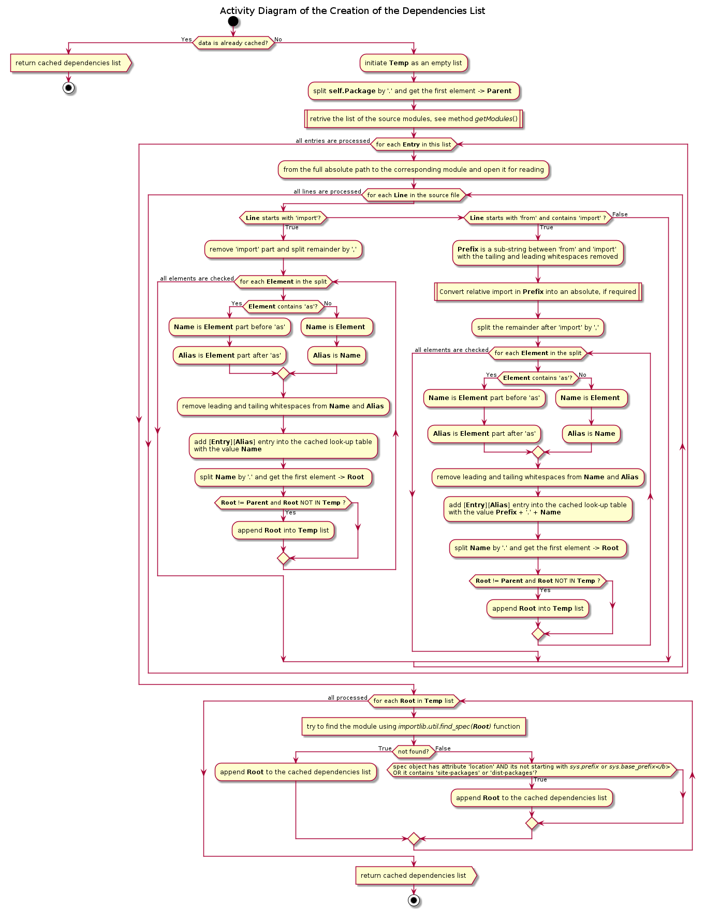

# UD007 Reference on the Module introspection_lib.package_structure

## Scope

This document describes the design, intended usage, implementation details and API of the module *package_structure*, which implements a number of functions and classes for the static analysis (source code inspection without imports) of the structure of Python packages in order to construct a hierarchical tree structure of the package (with the adjustible selection / exclusion criteria), a list of the dependencies and mapping of the local namespace names / aliases to the imported objects. This functionality is to be used, primarily, for the automated creation of the build configuration files.

The implemented functional components are:

* Functions
  * *IsPyFile*()
  * *IsPyPackage*()
  * *SelectPySourceFiles*()
  * *GetQualifiedName*()
  * *ResolveRelativeImport*()
* Classes
  * **PackageStructure**

## Intended Functionality and Use

This module is intended to be used a tool to help in the automated creation of the configuration files for the **setuptools** based packaging systems. The purpose is to perform the static analysis of the file system and the content of the found source files in order to build a hierarchical structure of a package and to generate the list of dependencies of the package. The **setuptools** system provides a number of automatic discovery features, but they have their own limitations. The idea behind this module is to generate explicit lists of options in the configuration files instead of relying on the auto-detection methods of the **setuptools** system.

For example, a package may contain a number of modules, sub-packages and sub-modules, which implement the base functionality. But, in addition, it may contain a number of executable scripts designed for some specific tasks based on the functionality of the package. I, personally, also prefer to distribute the packages (as libraries) together with the test suits. Neither the work script sets, nor the test suits are, strictly speaking, part of the library concerining the API, therefore there is no logic in turning the respective sub-folders into sub-packages. Thus, the auto-detection features of the **setuptools** system ignore such not sub-packages sub-folders. The algorithm used in this module, on contrary, is gready - every found Python source file in any of the sub-folders is included into the analysis, unless explicitely requested otherwise.

Both individual source files and the entire sub-folders (including all their nested sub-sub-folders) can be excluded using simple match patterns including Unix shell-style wildcards (see **fnmatch** in the Python Standard Library). The individual files are filtered by application of the patterns to the base filenames, whereas the folder names are matched on the remaining part of the path after the removal of the common prefix (path to the 'root' folder of the analysis). All sub-folders remaining after application of the filtering and containg, at least, one Python source file (not filtered out by the second set of patterns) will be included into the distibution configuration file. Another convention is that the 'root' folder in the analysis will be made into the 'top level' element ('root' package).

All selected Python source files are to be analyzed, and a list of the 'top level' dependencies, whcih are not parts of the Standard Library, should be created. Also, a list of the 'packaging' names for the selected sub-folders should be created using the following conventions: a) the 'root' folder of the analyzed package is supposed to be installed as the 'top' level *distribution* package, even if this folder is an *import* sub-package of another package; and b) even if the included sub-folder is not a proper Python import (sub-) package it should be treated as a sub-package. Finally, the 'root' package metadata should be extracted as well.

This data can be passed into another module, class method or function, which is responsible for the generation of the packaging configuration files as in a fictional example below:

```python
from introspection_lib.package_structure import PackageStructure

...

Analyzer = PackageStructure('path/to/some/package')
FullPackageName = Analyzer.Package # as in package.sub-package.sub-sub-package, etc.
PackageDistributionName = FullPackageName.split('.')[-1]
...

#name of the function is fictional, with the following signature:
#+ FolderPath: str, PackageName: str /,* , **kwargs/ -> None
GenerateConfig(Analyzer.Path, PackageDistributionName,
                Dependencies = Analyzer.getDependencies(),
                PackagingNames = Analyzer.getPackagingNames(),
                Metadata = Analyzer.Metadata)
```

The automatically generated configuration files, in many cases, may be used directly; but, in general, they must be adjusted / corrected manually, especially concerning the restrictions. However, the proper structure (template) is guaranteed in the auto-generated configuration files, as well as proper filling-in of the majority of the 'boiler-plate' information.

## Design and Implementation

The detection of dependencies is based solely on the static analysis of the source code of the source files selected for the packaging. Only the direct importing statements as `import module` and `from module import something` are concerned. The functional call based imports (e.g. using **importlib**) are ignored. There several reasons for this design decision:

* Dynamic (functional call) imports is mostly used to 'load-on-demand' specific modules in response to the specific user input or received data, thus the names of the respective packages or module may be even indeductible using static source code analysis
* There are may other user-defined functions or methods, which perform dynamic import, and cannot be deducted without very sofisticated lexic analysis / parsing of the code; therefore spending a lot of efforts on the analysis of the *importlib.import_module*() alike calls may not solve the dynamic import problem
* The static import - import statements - on the other hand, are explicit and they do not allow usage of aliases in place of the actual names of the modules / packages, at least, the root of the qualified dot-notation name - which can be found in the file system without doing actual imports

Basically, the algorithm looks up all `import ...` and `from ... import ...` statements and forms a list of the unique 'root' / 'top level' names of the imports (the first part in the dot notation name) and filters out all names referencing the Python Standard Library top level modules (like *os*) and packages (like *collections*). The remainder of the list is the 3rd party packages, i.e. the dependencies, which can be put into the dependencies part of the configuration file. The currently installed versions of the respective packages are indicated as the initial restrictions. See [DE003](../Design/DE003_package_structure.md) design document for further references.

As the added functionality, the mappings of the imported and aliased names into the fully qualified names of the imported objects (per namespace / source code module) is generated during the analysis, cached and made available for more detailed analysis of the source code tasks.

The components diagram of the module is shown below:


The clients of the module are supposed to work mostly with the implemented classes. The implemented functions are intended primarily to be called by the methods of those classes, however, they can be helpful on their own. Therefore, they are implemented as 'public' functions, and not as 'private' one or internal methods of the said classes.

The function *IsPyFile*() checks if the passed argument is the path to an existing Python source file, not a symlink. Thus, the argument must be as string - otherwise **UT_TypeError** exception is raised; the file must exist, it must have the '.py' extension, and it must be not a symlink.


The function *IsPyPackage*() checks if the passed argument is the path to an existing folder, not a symlink, which is considered to be a Python package. Thus, the argument must be as string - otherwise **UT_TypeError** exception is raised; the folder must exist, it must have the '\_\_init\_\_.py' file within, and it must be not a symlink.


The function *SelectPySourceFiles*() generates a list of the base filenames of all actual Python source files (ignoring the symlinks) found within a specified folder, which also should not be a symlink. The returned list is empty if there no actual Python source files within the folder, or the passed path is symlink itself. The function does not look inside the sub-folders, only within the specified folder. The argument must be as string - otherwise **UT_TypeError** exception is raised.


The function *GetQualifiedName*() attempts to create a fully qualified import name for a module or a (sub-) package. Basically, if it finds a Python source file or a Python package located at the passed path, the function checks if the parent folder to this file or folder is a Python package. Thus, it climbs up the file structure hierarchy until it reaches the folder, which is not a Python package, or the root of the tree. The *base filename* of a Python source file without the '.py' extension is used as the *module* name, and the base name of a folder is used as the respective (sub-) package name. Depending on the type and value of the argument the returned value is constructed following the rules below:

* Not a string input -> **UT_TypeError** is raised
* An arbitrary string, which is not an existing file / folder path -> **None** value is returned
* String path leading to a symlink to a file or folder -> **None** value is returned
* String path leading to an actual file (not a symlink), but not a Python source file -> **None** value is returned
* String path leading to an actual folder (not a symlink), but not a Python package -> **None** value is returned
* Path to a stand-alone Python module / script, which is not part of a package -> string *module* name value (see above)
* Path to a 'root' (not nested) Python package -> string *package* name value (see above)
* Path to Python module, wich is a part of a package -> string *package/.subpackage/.module* import name with a variable depth of inclusion
* Path to Python package, wich is a part of another package -> string *package/.subpackage/.subpackage* import name with a variable depth of inclusion


The function *ResolveRelativeImport*() is designed for the resolution of the relative imports into absolute import names relative to the qualified name of the module, where these imports are made. It requires two arguments: a path to a Python module, and the absolute or relative import name. The both arguments must be strings, otherwise **UT_TypeError** exception is raised. If the passed import name is absolute - i.e. it doesn't start with any number of dots '.', the file path is ignored and the passed absolute import name is returned. If the passed import name is relative - i.e. it starts with one or more consecutive dots, the passed file path must lead to an existing actual Python source file - otherwise **UT_ValueError** is raised. The fully qualified name of the module is resolved (see *GetQualifiedName*()) by the passed file path. The number of leading dots in the import name is counted, and the corresponding number of the tailing elements in the module's qualified name are removed. The import name is stripped of the leading dots and the remaining part is attached via dot to the tail-stripped module's qualified name. Note, that the relative import cannot point outside the 'root' package of the respective module - otherwise **UT_ValueError** is raised.


The class diagram of the module is shown below


The class **PackageStructure** is responsible for the static analysis of a Python *import* package structure and dependencies, as a help tool for the auto-generation of the *distribution* package. It must be instantiated with a path to the respective folder.

Upon instantiation this class checks that the respective folder is a Python *import* package, and it raises **introspection_lib.base_exceptions.UT_TypeError** exception otherwise. It also resolves the fully qualified name of that package, which is stored in a 'private' instance attribute, and it is accessible via a read-only property *Package*. The resolved absolute path to the folder is also stored in a 'private' instance attribute, which is interfaced by the read-only property *Path*. Also, the initialization method creates 'private' instance attributes to store the Unix shell wildcard compatible matching patterns for the base filenames of the Python source files, as well as for the residual paths to the source sub-folders, relative to the 'root' folder path. These 'private' attributes are interfaced by the read-only properties *FilesFilters* and *FoldersFilters*. Initially, these lists of strings are populated as defined in the [DE003](../Design/DE003_package_structure.md) design document. Finally, the rest of the 'private' instance attributes is created to cache the results of the analysis later, but initially they are set to dummy values.

The filtering patterns may be modified at any time using one of the following methods:

* *setFilesFilters*() and *setFoldersFilters*() - the entire set of the filtering rules is passed as a sequence of strings; if any analysis data is cached, this cache is invalidated and cleared
* *addFilesFilter*() and *addFoldersFilter*() - the passed single sting pattern is to be appended into the corresponding set; if this pattern is already present in the set, it is not added (to avoid duplications), and the cached analysis data is preserved; otherwise the cache is invalidated and cleared
* *removeFilesFilter*() and *removeFoldersFilter*() - the passed single sting pattern is to be appended into the corresponding set; if this pattern is already present in the set, it is not added (to avoid duplications), and the cached analysis data is preserved; otherwise the cache is invalidated and cleared

The read-only property *Metadata* performs a simplified lexical analysis of the *\_\_init\_\_.py* file in the package 'root' folder, assuming a specific syntax. It searches assigment statements to the pre-defined names made at the 'top level' within the module (no indentations). The found names, assigned values and the source code file line numbers are cached in the internal dictionary, thus with the repeated access the already cached values are returned. All assignments are supposed to fit one line in the source code.


The method *getModules*() recursively iterates over the files structure of the 'root' folder and selects all Python source files, for which two conditions are true:

* the folder (dir) part of the remainder of the path with the 'root' folder prefix removed does not match any of the folders filtering patterns
* the base filename does not match any of the files filtering patterns

**Note**: the treatment of the paths is OS-independent, but internally, all relative (remaining) paths are stored using Unix convention, i.e. '/' path separator.


The method *getPackagingNames* is designed to generate the list of the (sub-) packages names to be included into a distriution package, as the value of the option 'packages' in the section '[options]' of the *setup.cfg* file. It assumes that:

* Even if the current 'root' folder is an *import* sub-package of another package, it will be packaged as a 'top level' *distribution* package
* All selected source files sub-folders must be included, even if they are not *import* sub-packages


The method *getDependencies*() performs the static analysis of all found Python source files concerning the static import statements. It caches both the found 'top level' dependencies list and the per module import names -> qualified real names of the components look up table. However, it returns only the list of the 'top level' dependencies. See [DE003](../Design/DE003_package_structure.md) for the applied rules.



Finally, the method *getImportNames*() calls the *getDependencies*() method and returns the cached data.

## API Reference

### Functions

**IsPyFile**(FileName)

*Signature*:

str -> bool

*Args*:

* *FileName*: **str**; a path to a file (absolute or relative to the current working directory)

*Returns*:

**bool**: the result of the check

*Raises*:

**UT_TypeError**: passed argument is not a string

*Description*:

Checks if a file exists, it is not a link, and it has '.py' extention, i.e. it is a Python source file.

**IsPyPackage**(FolderName)

*Signature*:

str -> bool

*Args*:

* *FolderName*: **str**; a path to a folder (absolute or relative to the current working directory)

*Returns*:

**bool**: the result of the check

*Raises*:

**UT_TypeError**: passed argument is not a string

*Description*:

Checks if a folder exists, it is not a link, and it has *\_\_init\_\_.py* file within (actual, not a link), i.e. it is a Python package.

**SelectPySourceFiles**(FolderName)

*Signature*:

str -> list(str)

*Args*:

* *FolderName*: **str**; a path to a file (absolute or relative to the current working directory)

*Returns*:

**list(str)**: the list of the base filenames of the found source files

*Raises*:

**UT_TypeError**: passed argument is not a string

*Description*:

Finds all Python source files (not symlinks) present in a directory (not a symlink itself).

**GetQualifiedName**(Path)

*Signature*:

str -> str OR None

*Args*:

* *Path*: **str**; a path to a folder or module (absolute or relative to the current working directory)

*Returns*:

* **str**: the fully qualified name of a module / (sub-) package, if it was resolved
* **None**: if it was not resolved

*Raises*:

**UT_TypeError**: passed argument is not a string

*Description*:

Attempts to resolve the qualified (dot notation) of a module or (sub-) package from its path. The symlinks are ignored.

**ResolveRelativeImport**(FileName, ImportName)

*Signature*:

str, str -> str

*Args*:

* *FileName*: **str**; a path to an actual Python source file, ignored in the case of an absolute import as long as it is string
* *ImportName*: **str**; an absolute or relative import name

*Returns*:

**str**: the absolute import path

*Raises*:

* **UT_TypeError**: any of the arguments is not a string
* **UT_ValueError**: only in the case a relative import - first argument is not a path to an actual Python source file, OR the relative path leads to the outside of the 'root' package of the module, OR the module itself is not a part of a package

*Description*:

Attempts to resolve the relative import into an absolute relatively to the 'root' package of the referenced by path module. The module must be whithin a package, and the relative path must end-up within the 'root' of the package structure, to which the referenced module belongs. The actual existence of a module referenced by the produced absolute path is not checked. The passed absolute imports are not modified.

### Classes

#### PackageStructure

Static analyzer of a Python package folder structure.

***Instantiation***:

**\_\_init\_\_**(Path)

*Signature*:

str -> None

*Args*:

* *Path*: str; path to a Python import package (as folder)

*Raises*:

* **UT_TypeError**: passed argument is not a string
* **UT_ValueError**: passed argument is a string, but not a path to a Python package folder

*Description*:

Initializer. Checks and stores the folder path and the fully qualified package name. Sets the files and folders filtering option to the default values, i.e. to ignore everthing related to the setuptools packaging process.

***Properties***:

* *Path*: (read-only) **str**; path to the folder
* *Package*: (read-only) **str**; fully qualified package name
* *FilesFilers*: (read-only) **list(str)**; Unix shell base filenames filtering patterns
* *FoldersFilers*: (read-only) **list(str)**; Unix shell sub-folders names filtering patterns
* *Metadata*: (read-only) **dict(str -> dict(str -> int OR str))**; metadata found for the package

***Instance methods***:

**getModules**()

*Signature*:

None -> list(str)

*Returns*:

**list(str)**: remaining parts of the paths to the modules, relative to the package's folder

*Description*:

Makes a list of the relative paths to all found Python source modules, recursively checking all sub-folders, even if they are not sub-packages. Folders and files filtering patterns are applied.

**getDependencies**()

*Signature*:

None -> list(str)

*Returns*:

**list(str)**: found unique 'top level' dependencies, excluding the Standard Library

*Description*:

Makes a list of the top level dependencies found in the Python source modules, recursively checking all sub-folders, even if they are not sub-packages. Folders and files filtering patterns are applied.

**getImportNames**()

*Signature*:

None -> dict(str -> dict(str -> str))

*Returns*:

**dict(str -> dict(str -> str))**: per module mapping of the local (namespace) names (as aliases) to the fully qualified names of the imported components; the top level keys are the relative paths to the respective modules

*Description*:

Creates a look-up table mapping per module the local names of the imported components to their fully qualified names.

**getPackagingNames**()

*Signature*:

None -> list(str)

*Returns*:

**list(str)**: dot-separated qualified names of the package and sub-packages, assuming this one being installed as 'top level'

*Description*:

Creates a list of the (sub-) packages names relative to this one, which is to be packaged as 'top level'.

**addFilesFilter**(Pattern)

*Signature*:

str -> bool

*Args*:

* *Pattern*: **str**; Unix shell wildcard-enabled match pattern

*Returns*:

**bool**: *True* if the pattern is added, *False* - if it is not added (was present already)

*Raises*:

* **UT_TypeError**: passed argument is not a string

*Description*:

Method to add a new base filename matching pattern for filtering.

**removeFilesFilter**(Pattern)

*Signature*:

str -> bool

*Args*:

* *Pattern*: **str**; Unix shell wildcard-enabled match pattern

*Returns*:

**bool**: *True* if the pattern is removed, *False* - if it is not removed (was not present)

*Raises*:

* **UT_TypeError**: passed argument is not a string

*Description*:

Method to remove an existing base filename matching pattern for filtering.

**setFilesFilters**(Patterns):

*Signature*:

seq(str) -> None

*Args*:

* *Patterns*: **seq(str)**; a sequence of Unix shell wildcard-enabled match patterns

*Raises*:

* **UT_TypeError**: passed argument is not a sequence of strings

*Description*:

Method to set the entire list of the base filename matching pattern for filtering.

**addFoldersFilter**(Pattern)

*Signature*:

str -> bool

*Args*:

* *Pattern*: **str**; Unix shell wildcard-enabled match pattern

*Returns*:

**bool**: *True* if the pattern is added, *False* - if it is not added (was present already)

*Raises*:

* **UT_TypeError**: passed argument is not a string

*Description*:

Method to add a new sub-folder matching pattern for filtering.

**removeFoldersFilter**(Pattern)

*Signature*:

str -> bool

*Args*:

* *Pattern*: **str**; Unix shell wildcard-enabled match pattern

*Returns*:

**bool**: *True* if the pattern is removed, *False* - if it is not removed (was not present)

*Raises*:

* **UT_TypeError**: passed argument is not a string

*Description*:

Method to remove an existing sub-folder matching pattern for filtering.

**setFoldersFilters**(Patterns)

*Signature*:

seq(str) -> None

*Args*:

* *Patterns*: **seq(str)**; a sequence of Unix shell wildcard-enabled match patterns

*Raises*:

* **UT_TypeError**: passed argument is not a sequence of strings

*Description*:

Method to set the entire list of the sub-folder matching pattern for filtering.
