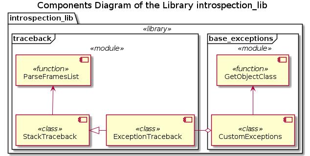

# Library introspection_lib

## Purpose

Functionality enhancements and usage convenience wrappers for the Python 3 Standard Library introspection functionality. E.g. call stack and exception traceback analysis, signature of the methods and functions, class composition, etc. It provides framework of the traceback enhanced analysis custom exceptions and customized logging classes.

## Installation

### Via git

Clone the official repository into your local workspace / project folder:

```bash
$git clone <repository_path> "your projects folder"/introspection_lib
```

Check the system requirements and dependencies:

```bash
$cd "your projects folder"/introspection_lib
$python3 ./check_dependencies.py
```

### For developers only

Initialize the UML templates submodule

```bash
$cd "your projects folder"/introspection_lib/Documentation/UML/Templates
$git submodule init
```

Download the content of the UML templates submodule

```bash
$git submodule update --recursive --remote
```

### Via pip

You need a personal access token (with *api* scope), a deploy token (with *write_package_registry* scope) or a CI job token from GitLab. The installation command is:

```bash
pip install introspection_lib  --extra-index-url https://<token_name>:<token_value>@gitlab.com/api/v4/projects/25522607/packages/pypi/simple
```

The *pip* package manager should be able to find and install all missing dependencies automatically. However, the documentation is not included, only the source code and the test modules.

Please, consider using virtual enviroment in order to not mess with the global Python installation.

## System requirements

* Operational system: - any supported by the Python language developers (see [tested_OS](./Documentation/Tests/tested_OS.md)), e.g.
  * MS Windows (8, 10)
  * MacOS X
  * GNU Linux
* Python 3.6+ interpreter with the 'pip' installed
  * On POSIX systems (MacOS X, Linux) comes pre-installed
  * On MS Windows must be installed from [Python website](https://www.python.org/downloads/windows/)

This library does not depend on any other Python library / package except for the Standard Library (see [Dependencies.md](./Dependencies.md)).

## Library structure



## Documentation

All documentation on the library is written in Markdown format, see the [index list](./Documentation/index.md).

* [Requirements](./Documentation/Requirements/index.md)
* [Design](./Documentation/Design/index.md)
* [Tests](./Documentation/Tests/index.md)
* [User and API References](./Documentation/References/index.md)
